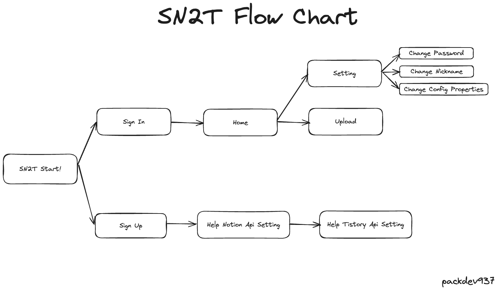

## 어플리케이션의 목표 
> "노션에서 티스토리로 쉽게 포스팅을 전송할 수 있게 하자"

## 📌 Notice
Tistory 가 OpenAPI 개발을 잠정 중단함에 따라 서비스가 종료되었음을 알립니다. 

---
## Flow Chart

## 기능 구현 목록
- [x] 포스팅을 전송한다 
  - [x] Notion 데이터베이스에 작성한 포스팅을 등록한다
  - [x] 사이트는 등록된 포스팅을 감지한다 
  - [x] 등록한 포스팅을 티스토리로 전송한다
- [x] Notion에 데이터베이스를 생성한다
  - [ ] 생성 과정을 설명해주는 웹 사이트를 제작한다  
    - [x] 데이터 베이스는 full page view로 설정해야 한다
    - [x] Add Connection에 Notion API 계정을 추가한다 
- [x] Tistory를 연동한다 
  - [x] Tistory APP ID, Secret Key 생성 과정을 설명해주는 웹 사이트를 제적한다 
  - [x] 두 키를 사용하여 Authorization Key와 Access Token을 자동으로 발급 받는다
- [ ] 회원 가입을 한다
- [ ] 로그인을 한다
  - [ ] 로그인 시 회원 정보들을 config 파일에 적용한다
- [x] Notion Secret Key를 저장한다 
- [x] Notion Database Id를 저장한다
- [x] 연동이 잘 되었는지 확인한다
  - [x] Database Query를 날려 응답이 온다면 정상적인 수행으로 간주한다 

## Reference
- **Tistory API** 
  - https://tistory.github.io/document-tistory-apis/apis/
- **Notion API**
  - https://developers.notion.com/
  - https://www.notion.so/my-integrations